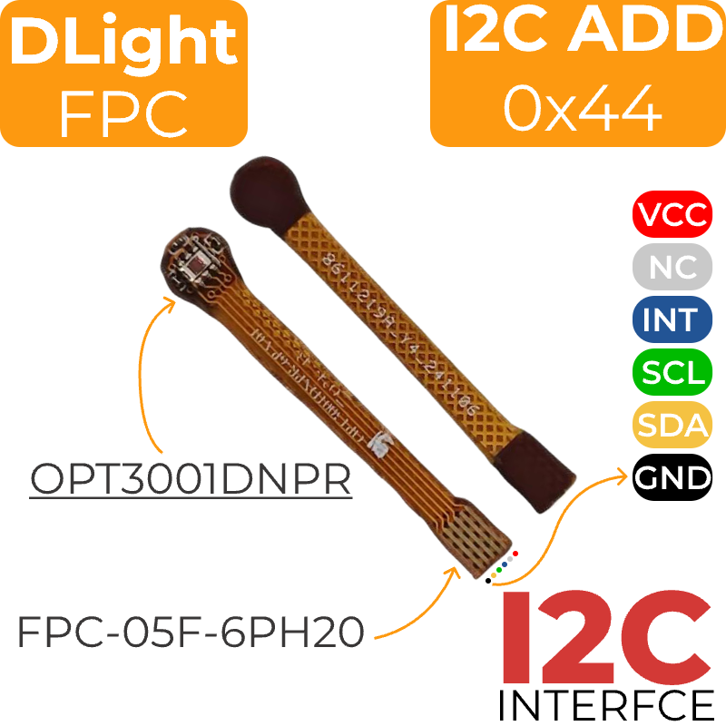

# FPC-OPT3001

<style>
img{
    width: 400px;
}
</style>



## 简介

这是一款基于 OPT3001DNPR 芯片的柔性FPC光照传感器，支持 I2C 接口，默认地址为 0x44。传感器可精准检测环境光强，响应范围广，适用于自动亮度调节、光照监测等应用。
采用 FPC-05F-6PH20 连接器，接口定义包括 VCC、NC、INT、SCL、SDA、GND，其中 SCL/SDA 为I2C数据与时钟线，INT 可用作中断输出。
柔性FPC设计方便在狭小空间内安装，适合智能设备、可穿戴设备及嵌入式应用。

## 产品参数

- 工作电压：1.6~3.6V
- 工作电流：<2.5uA
- 测量范围：0.01 Lux 至 83,000 Lux
- 通信接口：FPC 0.5mm-6Pin I2C
- 外形尺寸：30mm(W) * 3.6mm(H)
- FPC焊盘尺寸：0.3mm(W) * 4mm(H)
- FPC焊盘间距：0.5mm

## 引脚说明


| 标号 | 名称 | 功能描述 |
| ---- | ---- | -------- |
| 1    | GND  | 电源负极 |
| 2    | SDA  | 数据线   |
| 3    | SCL  | 时钟线   |
| 4    | INT  | 中断     |
| 5    | NC   | 未使用   |
| 6    | VCC  | 电源正极 |


## 使用教程

### arduino

#### 准备

- 硬件

    1. 一块支持 Arduino IDE 的开发板


#### 接线图

待补充

#### 样例代码1 - 连续转换模式

将 OPT3001 配置为自动量程、连续转换模式

```c++
#include <Wire.h>

#define I2C_SDA 8
#define I2C_SCL 10

#define OPT3001_ADDRESS 0x44  // OPT3001 的 I2C 地址，根据 ADDR 引脚连接 GND
// #define OPT3001_ADDRESS 0x45    //  OPT3001 的 I2C 地址，根据 ADDR 引脚连接 VCC

// 配置寄存器值：自动量程、连续转换模式
#define OPT3001_CONFIG 0xCE10

void setup() {
  Serial.begin(115200);
  Wire.begin(I2C_SDA,I2C_SCL,100000);     // SDA SCL frequency
  // 配置 OPT3001
  Wire.beginTransmission(OPT3001_ADDRESS);
  Wire.write(0x01);  // 寄存器地址：配置寄存器
  Wire.write(OPT3001_CONFIG >> 8);  // 高字节
  Wire.write(OPT3001_CONFIG & 0xFF);  // 低字节
  Wire.endTransmission();
}

void loop() {
  float lux = readLux();
  Serial.print("光照强度: ");
  Serial.print(lux);
  Serial.println(" lx");

  delay(1000);  // 每秒读取一次
}

float readLux() {
  uint16_t result;

  // 读取结果寄存器
  Wire.beginTransmission(OPT3001_ADDRESS);
  Wire.write(0x00);  // 寄存器地址：结果寄存器
  Wire.endTransmission();

  Wire.requestFrom(OPT3001_ADDRESS, 2);  // 读取 2 字节
  if (Wire.available() == 2) {
    uint8_t high = Wire.read();
    uint8_t low = Wire.read();
    result = (high << 8) | low;
  }

  // 计算光照强度
  uint8_t exponent = (result >> 12) & 0x0F;  // 指数部分
  uint16_t mantissa = result & 0x0FFF;      // 尾数部分
  float lux = 0.01 * pow(2, exponent) * mantissa;
  return lux;
}
```


#### 样例代码2 - OLED屏幕上实时显示测量值

在 OLED 屏幕上实时显示测量值

您需要使用 Arduino 库管理器安装 ``Adafruit_SSD1306`` 库:

1. 启动 Arduino IDE，然后通过以下方式打开库管理器： ``Sketch`` ➔ ``Include Library`` ➔ ``Manage Libraries...``

2. 在 ``Filter your search...`` 字段中搜索 ``Adafruit_SSD1306`` 库，然后点击 ``install`` 按钮进行安装。


```c++
#include <Wire.h>
#include <Adafruit_GFX.h>
#include <Adafruit_SSD1306.h>

#define I2C_SDA 8
#define I2C_SCL 10

#define OPT3001_ADDRESS 0x44  // OPT3001 的 I2C 地址，根据 ADDR 引脚连接 GND
// #define OPT3001_ADDRESS 0x45    //  OPT3001 的 I2C 地址，根据 ADDR 引脚连接 VCC
// 配置寄存器值：自动量程、连续转换模式
#define OPT3001_CONFIG 0xCE10


#define SCREEN_WIDTH 128      // OLED display width, in pixels
#define SCREEN_HEIGHT 64      // OLED display height, in pixels
#define OLED_RESET -1         // Reset pin # (or -1 if sharing Arduino reset pin)
#define SSD1306_ADDRESS 0x3C  ///< See datasheet for Address; 0x3D for 128x64, 0x3C for 128x32


Adafruit_SSD1306 display(SCREEN_WIDTH, SCREEN_HEIGHT, &Wire, OLED_RESET);

void setup() {
  Serial.begin(115200);
  Wire.begin(I2C_SDA, I2C_SCL, 100000);  // SDA SCL frequency
  // 配置 OPT3001
  Wire.beginTransmission(OPT3001_ADDRESS);
  Wire.write(0x01);                   // 寄存器地址：配置寄存器
  Wire.write(OPT3001_CONFIG >> 8);    // 高字节
  Wire.write(OPT3001_CONFIG & 0xFF);  // 低字节
  Wire.endTransmission();

  // while (!Serial)
  //   delay(10);  // will pause Zero, Leonardo, etc until serial console opens
  // // 初始化 OLED 显示屏
  if (!display.begin(SSD1306_SWITCHCAPVCC, SSD1306_ADDRESS)) {  // 0x3C 是 OLED 的 I2C 地址
    Serial.println(F("SSD1306 allocation failed"));
    for (;;)
      ;  // 进入无限循环
  }
  display.display();  // 显示启动画面
  delay(1000);
  display.setTextSize(1);   // Draw 1X-scale text
  display.setTextColor(SSD1306_WHITE); // Set OLED Text Color is White
}

void loop() {
  float lux = readLux();
  Serial.print("光照强度: ");
  Serial.print(lux);
  Serial.println(" lx");

  // Display data on OLED
  display.clearDisplay();   // Clear OLED Display
  display.setTextSize(2);   // Set Text Size
  display.setCursor(0, 0);  // Set Text Cursor (x,y) x=width y=hight
  display.printf("OPT3x 0x%02x\n",OPT3001_ADDRESS);  // 格式化为两位十六进制数
  display.setTextSize(2);                   // Set Text Size
  display.setCursor(0, 20);
  display.println("Light:");
  // display.printf("\n");
  display.setCursor(0, 25);
	display.printf("\n%.1f lux\n",lux);  
  display.display();
  delay(3000);  // 每秒读取一次
}

float readLux() {
  uint16_t result;

  // 读取结果寄存器
  Wire.beginTransmission(OPT3001_ADDRESS);
  Wire.write(0x00);  // 寄存器地址：结果寄存器
  Wire.endTransmission();

  Wire.requestFrom(OPT3001_ADDRESS, 2);  // 读取 2 字节
  if (Wire.available() == 2) {
    uint8_t high = Wire.read();
    uint8_t low = Wire.read();
    result = (high << 8) | low;
  }

  // 计算光照强度
  uint8_t exponent = (result >> 12) & 0x0F;  // 指数部分
  uint16_t mantissa = result & 0x0FFF;       // 尾数部分
  float lux = 0.01 * pow(2, exponent) * mantissa;
  return lux;
}
```

## 常见问题

还没有客户对此产品有任何问题，欢迎通过qq或者论坛联系我们！

## 包装信息

## 更多

- [原理图.pdf][FPC-OPT3001-CC-Studio-SCH-Circle-V01.pdf]
- [尺寸图.pdf][FPC-OPT3001-CC-Studio-DXF.pdf]
- [TI-OP3001.pdf]

[购买链接]

[FPC-OPT3001-CC-Studio-SCH-Circle-V01.pdf]: ../../_static/fpc-series/fpc-opt3001/hardware/FPC-OPT3001-CC-Studio-SCH-Circle-V01.pdf
[FPC-OPT3001-CC-Studio-DXF.pdf]: ../../_static/fpc-series/fpc-opt3001/dxf/FPC-OPT3001-CC-Studio-DXF.pdf
[TI-OP3001.pdf]: ../../_static/fpc-series/fpc-opt3001/docs/TI-OPT3001.pdf
[购买链接]: https://item.taobao.com/item.htm?ft=t&id=947730889262
